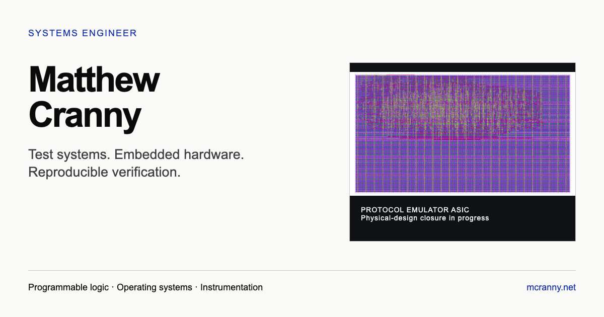

# Matthew Cranny — Engineering Portfolio

Personal engineering portfolio for Matthew Cranny, a systems engineer focused on automated test systems, custom hardware, semiconductor manufacturing equipment, instrumentation, and firmware validation.

**Live site:** [mcranny.net](https://mcranny.net)

## Professional focus

I build automated test software and custom hardware used to qualify control boards for advanced semiconductor manufacturing tools. My work spans electrical and analog-performance testing, instrumentation control, firmware feature validation, production board acceptance, and coordinated firmware deployment across installed equipment.

The portfolio is organized around this professional work. Independent projects appear as supporting evidence of related verification, instrumentation, scientific-computing, and systems-programming methods.

## Selected independent projects

- [Hardware Verification Framework](https://mcranny.net/hardware) — reusable Python and cocotb verification for deterministic RTL stimulus, waveform comparison, diagnostics, and reporting.
- [Virtual Oscilloscope Simulator](https://mcranny.net/scope) — a testable model of waveform generation, conversion, analog response, acquisition, triggering, and full-record measurement.
- [Asteroid Intercept Planner](https://mcranny.net/neo) — JPL data ingestion, orbital-transfer search, endpoint validation, and an interactive mission viewer.
- [B-Tree Storage Engine](https://mcranny.net/btree) — a disk-backed Rust key-value engine with redo logging, deletion rebalancing, and differential testing against SQLite.

These projects are independent work and are not employer systems. Source repositories are linked from each case study.

## Site qualities

- Dependency-free HTML, CSS, and JavaScript with no client framework or application build step.
- Responsive layouts and navigation for desktop, tablet, and mobile viewports.
- Light and dark themes with reduced-motion support.
- Keyboard-accessible navigation, visible focus states, skip links, and descriptive image alternatives.
- Clean production URLs, canonical metadata, social previews, structured profile data, and a maintained sitemap.
- Lazy-loaded NEO mission data so the homepage remains independent of the interactive viewer payloads.

## Deployment

The static site is deployed to [mcranny.net](https://mcranny.net) through Cloudflare. Redirects, caching behavior, security headers, and public security contact information are versioned with the site source.

## Contact

Professional contact information, profiles, and the current résumé are available on the [contact page](https://mcranny.net/contact).
