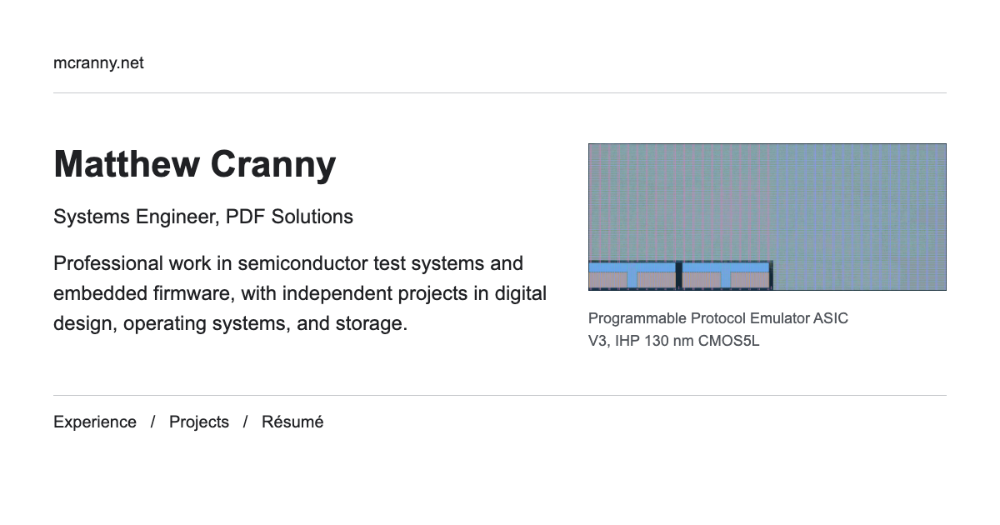

# Matthew Cranny | Engineering Portfolio

[](https://mcranny.net)

Personal portfolio covering automated test systems, custom hardware, instrumentation, and firmware validation for semiconductor manufacturing equipment.

**Live site:** [mcranny.net](https://mcranny.net)

## Projects

- [Programmable Protocol Emulator ASIC](https://mcranny.net/protocol-emulator): V3 SRAM programs, deadline-driven pin timing at 48 MHz, Artix-7 FPGA operation, and native V2/V3 chip explorers.
- [TestOS](https://mcranny.net/testos): UEFI x86-64 systems work with storage, HTTP, and network interoperability checks in QEMU.
- [Hardware Verification Framework](https://mcranny.net/hardware): Python and cocotb tooling for deterministic RTL stimulus, waveform comparison, and diagnostics.
- [Virtual Oscilloscope Simulator](https://mcranny.net/scope): waveform generation, analog response, acquisition, triggering, and measurement in a browser viewer.
- [Asteroid Intercept Planner](https://mcranny.net/neo): JPL data ingestion, orbital-transfer search, endpoint validation, and interactive mission plots.
- [B-Tree Storage Engine](https://mcranny.net/btree): a disk-backed Rust key-value engine with redo logging, deletion rebalancing, and differential tests against SQLite.

These are independent projects. Each project page links its source repository and supporting results. Professional experience, contact details, and the current résumé are available on the site.

## Local development

The site uses plain HTML, CSS, and JavaScript. Python's standard library builds `dist/` from the public file list in `scripts/public-files.json`.

```sh
python3 scripts/build_site.py
python3 scripts/preview_site.py --port 5001
```

Open [localhost:5001](http://127.0.0.1:5001). Rebuild after editing source files. Add new public assets to `scripts/public-files.json` so they are included in the build.

The site supports responsive navigation, light and dark themes, keyboard controls, and reduced motion. The mission viewer loads its data on demand. Both layout viewers run natively in the case study. Each loads same-origin, checksum-verified polygon tiles on demand and provides a static fallback.

## Validation

With the local preview running, install the development dependencies and run the checks in a separate terminal:

```sh
python3 -m venv .venv
source .venv/bin/activate
python3 -m pip install -r requirements-dev.txt
npm ci
npx playwright install chromium
python3 scripts/check_site.py
npm run check:browser
npm run check:media
npm run check:versions
npm run check:performance
```

Static checks validate page links, the sitemap, public assets, V2/V3 geometry inventories and tile hashes, artifact checksums, the custom 404 page, and résumé HTML/PDF consistency. Browser checks cover the nine site routes at four viewport sizes in both themes, including navigation, contrast, keyboard focus, unavailable storage, mission viewer recovery, and Content Security Policy violations. Media checks cover both versions’ native geometry, same-origin lazy loading, layer isolation, keyboard/touch navigation, fullscreen, HTTP/checksum/source mismatch recovery, unsupported browsers, no-JavaScript fallback, CSP, and MP4/WebM playback. Version checks cover shareable selections, browser history, keyboard navigation, legacy section links, both themes and viewport sizes, independent viewer state, and cancellation when changing tabs.

Performance checks enforce cold mobile download budgets for the homepage chip preview and both viewer startups at 1.6 Mbps and 150 ms latency.

GitHub Actions runs these checks on pull requests and pushes to `main`. The workflow does not deploy the site. Set `CHROME_PATH` to use an installed Chrome executable instead of Playwright's Chromium.

## Content and assets

### Résumé and social preview

Edit `scripts/resume-content.json`, then run `python3 scripts/render_resume.py` to update the résumé HTML and PDF. The exporter preserves the application résumé layout and updates `scripts/resume-fingerprint.json`. Role-specific application copies are maintained separately. Inspect the rendered PDF after edits to check spacing and clipping.

Edit `scripts/social-preview.html` and run `npm run render:social` to update `assets/site-preview.png`.

### ASIC versions, layouts, and evidence

The case study defaults to V3, with V2 retained in its own tab. `?version=v3` and `?version=v2` select a version; section fragments activate the containing panel. Without JavaScript both case studies are shown. The V2 panel presents the published milestone: software source `881495c` and selected physical source `447b3df`, with their documented elaboration/configuration correspondence. The physical result is a validated local TT checkpoint recovery. Exact metrics and evidence links are retained in `assets/protocol-emulator/v2/summary.json`.

The native canvas viewer adapts the project's Apache-2.0 static renderer at `856a1ea`. All runtime assets are served by this website; it uses no external iframe or viewer service. `js/layout-viewer.js` loads `js/gds-viewer.js` after activation. The renderer selects among six V2 raster resolutions (1,024–32,768 pixels across the die) or five V3 resolutions (1,024–16,384) at broad and intermediate scales, then loads original polygon coordinates for close views. It provides layer selection, keyboard/touch controls and fullscreen, with a 64 MiB decoded raster cache and a 12-tile geometry cache. Tile-boundary copies are clipped; polygons are not simplified. GDS text labels are retained in the original file but not drawn online.

`assets/protocol-emulator/v2/layout-447b3df/` contains the pinned manifest, 16 layer previews, 512 gzip geometry tiles (about 105 MB total), and the original selected-layout archive (about 6.5 MB). Geometry loads only for the visible region after zooming. The 40.3 MB uncompressed GDS exceeds the 25 MiB asset limit, so its checksum-verified original release archive provides the download. The complete site is checked against the asset count and per-file size limits during every build.

To rebuild the V2 imported assets, run `python3 scripts/import_v2_layout.py`. This checks the pinned published manifest, all geometry tile checksums, release archive, and original GDS hash; it refuses a changed upstream manifest. The upstream export records independent KLayout/gdstk polygon inventory agreement.

To regenerate the multi-resolution tiles, install Pillow in the Python environment
and use Chromium through Playwright. The generator checks every original geometry
tile, rasterizes its polygons with 2× supersampling, and builds lossless per-layer
and combined WebP tiles with neighboring-pixel gutters. Four rendering pages write intermediate
PNGs to a fresh directory, then the builder publishes `raster-v1/` and
`overview.webp`. Set `GDS_RASTER_SCRATCH` to choose the parent directory for these
temporary renders; each run prints its unique scratch path. To resume an interrupted render, set `GDS_RASTER_RESUME` to that path. Recorded source and rendering settings must match.

```sh
CHROME_PATH=/path/to/chrome PYTHON=/path/to/python node scripts/render_gds_pyramid.cjs
```

`scripts/optimize_layout_delivery.py` derives `display-v1/` from the verified lossless pyramids. It creates responsive article images and quality-85 WebP composites, plus a compact startup manifest and checksummed indexes per resolution and layer. The viewer requests only the needed indexes; individual layer tiles and close-view polygon geometry retain their original files. Existing `raster-v1/` assets remain published unchanged. The generator requires Pillow and refuses to overwrite a published display directory. Run `python3 scripts/update_asic_manifest.py` after generating a new display revision.

Use a new revisioned raster directory when changing already-published raster
content, and update the page configuration and cache rule together.

To regenerate the other technical images and UART example, install Pillow in a separate development environment and run:

```sh
python scripts/render_v2_assets.py /path/to/protocol-emulator-2.0.0rc1-examples.zip
```

The script verifies the released example archive, retains the pyramid-generated overview, renders a close-up from the polygon data, and plots the released TX trace plus RX input stimulus reconstructed from the example. It preserves the checked RX results and raw samples. The waveform is a Python cycle-model demonstration, not a hardware capture. Render settings are saved in `assets/protocol-emulator/v2/render.json`.

After reviewing generated assets and provenance, run `python3 scripts/update_asic_manifest.py` to record both versions’ checksums and regenerate the public-file allowlist. Ordinary builds only verify these records. Old V1 assets remain in source history/checkout but are excluded from deployment. Revisioned geometry assets use immutable caching; `_headers` serves tile files as raw gzip payloads with `no-transform` so browser checksum verification precedes decompression.

### Rebuilding V3 assets

The selected V3 physical source is `8b95d90b2fbbe5d742700884a49f2b89f1150904`.
Qualification run [40803741147](https://github.com/mcranny/protocol-emulator-asic/actions/runs/40803741147)
ran at workflow source `61065cf`; these identities are recorded separately in
`assets/protocol-emulator/v3/summary.json`. The GDS hash is
`050b88ed2253acb761f4f6365681a78da5e97520a03d02ff53b5a13e25d2be9f`.
The website retains acceptance, metrics, gate-level results, and source provenance.
The Cmod A7-35T section records the board bring-up and Vivado ILA capture: V3 at
48 MHz, host program loading/readback and execution, and a 25 kHz output with
960 samples per half-cycle.

V3 contains 8,784,464 polygons across 23 layer/datatype pairs. The original GDS
is supplied as a 5.4 MB gzip download. Its 16 × 8 geometry grid and five raster
levels retain all polygons while fitting both versions within the current
20,000-file hosting limit. The image dimensions are derived from each layout’s
bounds, including V3’s wider 8 × 4 die.

Use a clean upstream checkout at `0ff3c61217fbe6909750814c19e7100b2ddf1038`
for the exporter and a Python environment with gdstk, KLayout, and Pillow.
The importer needs authenticated `gh` access to the pinned artifacts. It verifies
all three artifact archives and the selected GDS/metrics against acceptance.
Run against a fresh V3 output directory; published asset directories are immutable.

```sh
python scripts/import_v3_layout.py --exporter-root /path/to/protocol-emulator-asic --cache /tmp/website-v3-artifacts
CHROME_PATH=/path/to/chrome PYTHON=/path/to/python node scripts/render_gds_pyramid.cjs assets/protocol-emulator/v3/layout-8b95d90 assets/protocol-emulator/v3/raster-v1
python scripts/render_gds_detail.py assets/protocol-emulator/v3 --box 420 90 620 190
python scripts/update_asic_manifest.py
```

### Recordings and mission data

The TestOS screenshots and 12.5-second recording were captured in QEMU 11.1.1 from the `ef72e55` CI boot image. The page includes ATA, AHCI, and NVMe data-disk checks, DHCP, an HTTP download, and TCP packet checks. Capture details, serial logs, packet data, and checksums are in `assets/testos/`.

The 12-second scope recording shows timebase, trigger, and filter adjustments in the browser viewer at `073ed63`. Capture details and checksums are in `assets/scope/`. Both recordings have MP4 and WebM versions and are under 5 MB per file. Comparison plots include WebP variants with PNG fallbacks.

The bundled NEO samples use the July 29, 2026 archive date from repository history. Their original export timestamp is unavailable. New exports record `exported_at` in UTC.

Third-party viewer libraries and their licenses are included with the corresponding assets.

## Deployment

Cloudflare serves [mcranny.net](https://mcranny.net). `wrangler.jsonc` runs the build and publishes only `dist/`. Development scripts, dependencies, and local output are excluded. `404.html` serves unknown paths. Redirects, cache rules, and security headers are defined in `_redirects` and `_headers`.

The Content Security Policy remains report-only. The browser suite checks for violations in local builds. Cloudflare currently injects a per-request inline challenge script on the live site, which violates the policy; resolve that integration before enabling enforcement. No reporting collector is configured. Update the structured-data hash in `_headers` when the inline JSON-LD changes.
